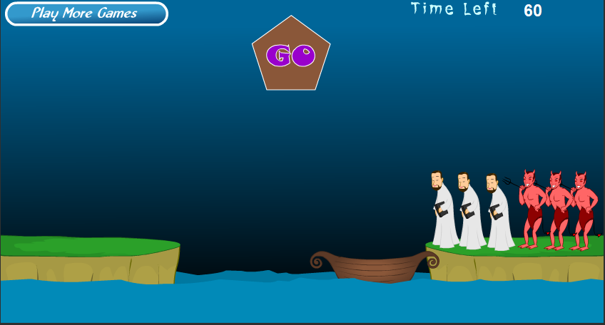
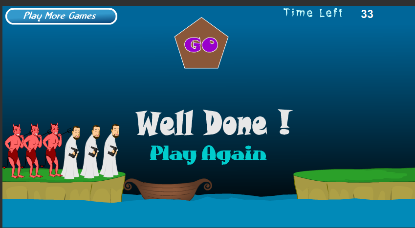

# 牧师与恶魔过河游戏
    

## 游戏中的类
类：|人物|环境
--|:--:|--:
 

## 游戏中的对象
对象|数量
---:|---:
牧师|3个
恶魔|3个
河|1条
船|1艘
座位|2个

## 类与对象的差别

类是对象的抽象；对象是类的实例。比如：人物是类，而牧师是对象。

## 恶魔的属性与方法
属性|方法
---|---:
杀牧师|用叉子叉死牧师
过河|  翻跟头上船与上岸

## onclick执行
    Onclick
    if(恶魔在岸上)
        恶魔空翻跳上船
    else
        恶魔空翻跳上岸

## 类或对象会是动词吗？
    可以是动词。比如类是运动，对象是跑步，打篮球等。

