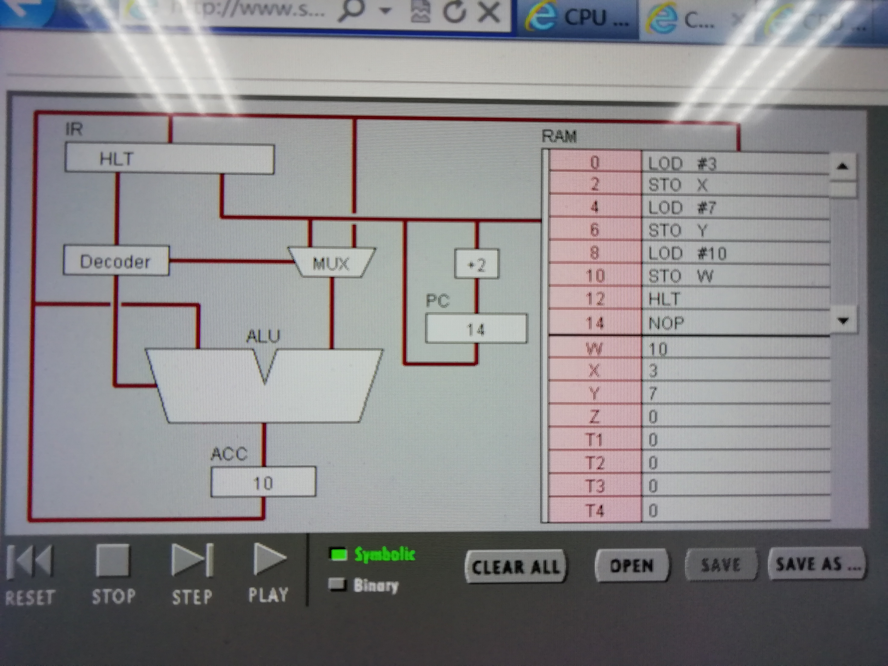
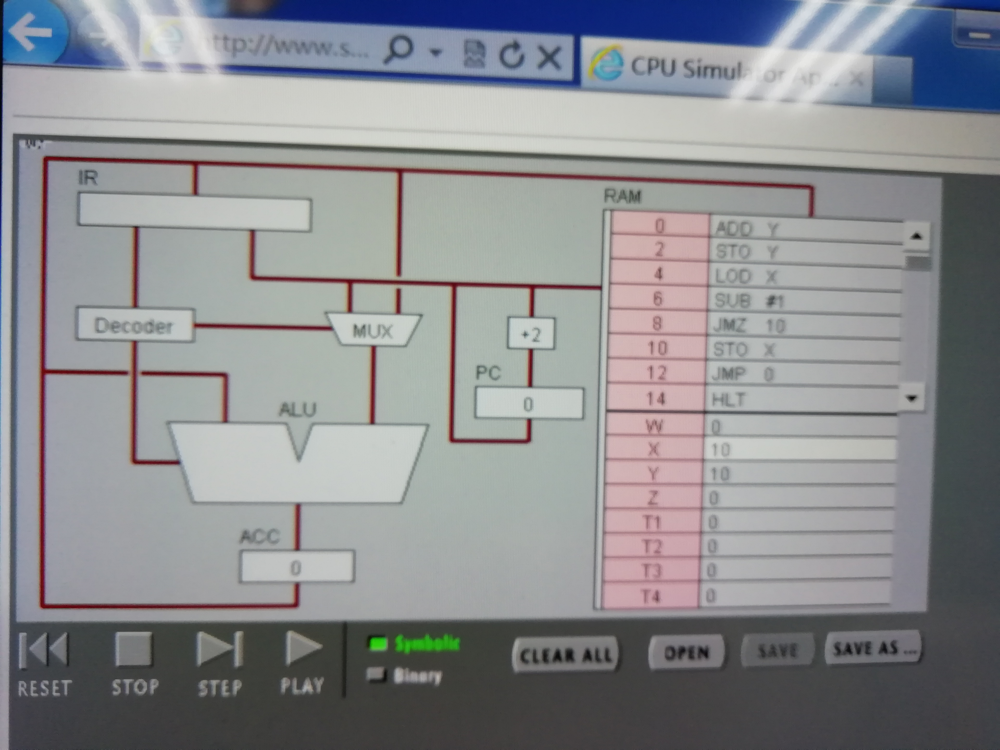

# 机器语言编程
----------
李浩维 18342046
-----

## 实验目的
    通过对机器语言编程的过程的观察，了解计算机计算的方法及步骤，并认识计算机各硬件的功能。

## 任务1
### step after step

#### 1、PC，IR 寄存器的作用。

    PC寄存器用于存放下一条指令所在单元的地址，IR寄存器用于存放当前从主存储器读出的正在执行的一条指令。

#### 2、ACC 寄存器的全称与作用。

    累加器A，作用：累加器A是一个具有特殊用途的二进制8位寄存器，专门用来存放操作数或运算结果。

#### 3、用“LOD #3”指令的执行过程，解释Fetch-Execute周期。

    PC从RAM中读取"LOD #3"，然后将指令存入IR,再到Decoder,再将3输入MUX,再传入ALU，最后传入ACC。

#### 4、用“ADD W” 指令的执行过程，解释Fetch-Execute周期。

    PC从RAM中读取"ADD W"，然后将指令存入IR,再到Decoder,ALU从ACC中提取数值，IR从RAM中读取W，W值读入进ALU，ALU中实现加法,最后将结果传入ACC。

#### 5、“LOD #3” 与 “ADD W” 指令的执行在Fetch-Execute周期级别，有什么不同。

    前者只访问一次内存，后者访问了两次。

### binary

1、写出指令 “LOD #7” 的二进制形式，按指令结构，解释每部分的含义。

    00010100 00000111 

前八位为步骤,后八位为操作数。

2、解释 RAM 的地址。

    只用于暂时存放程序和数据，一旦关闭电源或发生断电，其中的程序和数据就会丢失

3、该机器CPU是几位的？（按累加器的位数）

    16

4、写出该程序对应的 C语言表达。

    int w=3;
    int x=7;
    int y=w+x;

## 循环1

1、用一句话总结程序的功能

让变量x不断减一，直到x<0。

2、写出对应的 c 语言程序

int x;
while (x>=0)
    x--;

## 循环2

修改该程序，用机器语言实现 10+9+8+..1 ，输出结果存放于内存 Y

1、写出 c 语言的计算过程

int x=10;
int Y=0;
while (x>0){
    Y=Y+x;
    x--;
}
return Y;

2、写出机器语言的计算过程

00000100 10000001

00010001 00000001

00000101 10000001

00001101 00010000

00000100 10000010

00000000 10000001

00000101 10000010

00001100 00000000

00001111 00000000

3、用自己的语言，简单总结高级语言与机器语言的区别与联系。

联系:高级语言经编译可变为机械语言,都可以实现顺序，选择和循环 
区别：高级语言更接近人类语言,是给人看的 ; 机器语言是纯粹的二进制 
数据,一般人看不懂